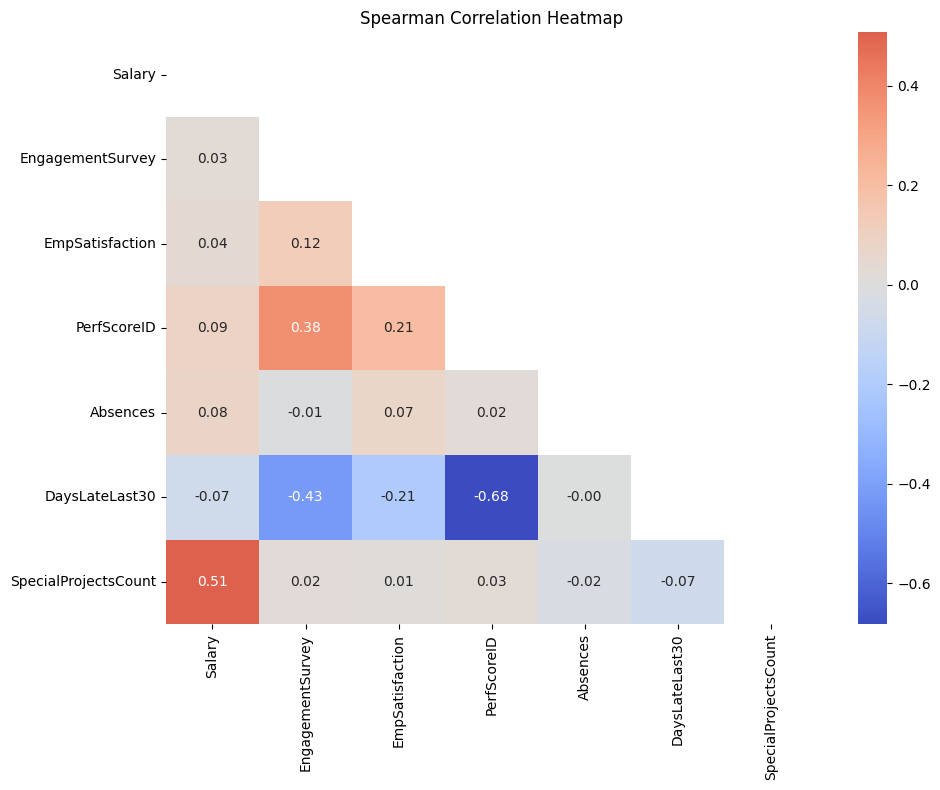
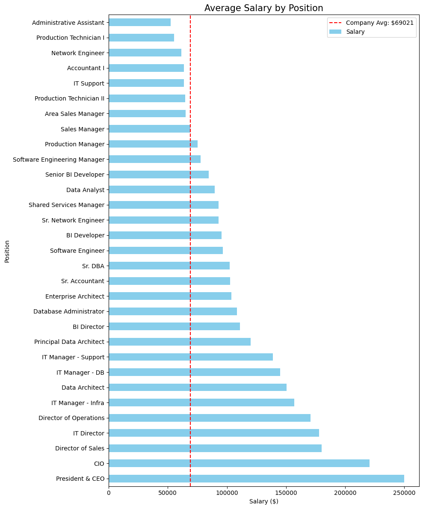
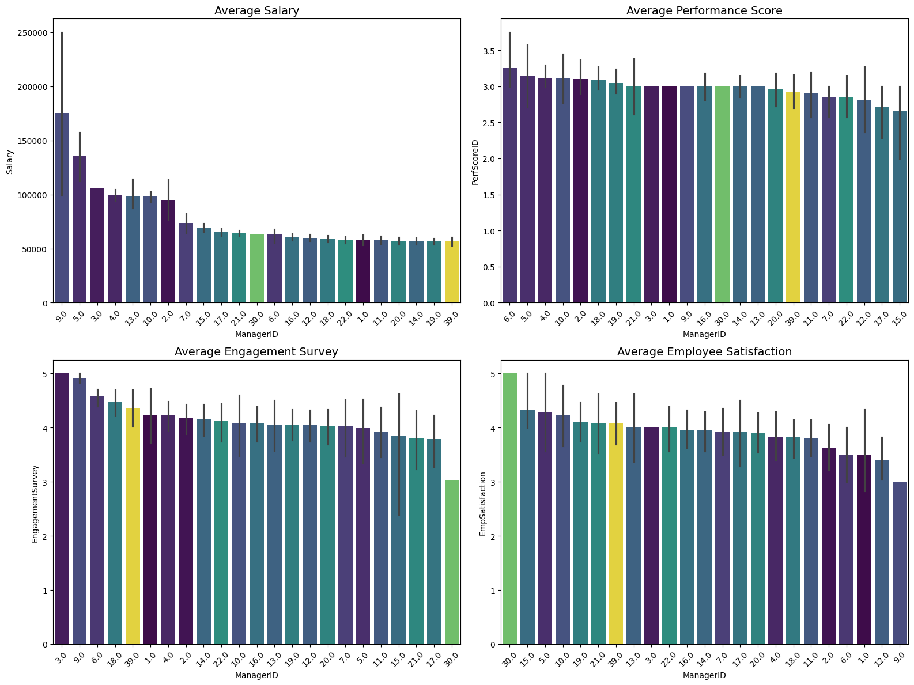

```python
import pandas as pd
import numpy as np
import matplotlib.pyplot as plt
import seaborn as sns
from scipy import stats
import statsmodels.api as sm
from statsmodels.formula.api import ols
from statsmodels.stats.multicomp import pairwise_tukeyhsd
from statsmodels.stats.multitest import multipletests
from scipy.stats import spearmanr
import statsmodels.formula.api as smf
from scipy.stats import chi2_contingency
from scipy.stats import kruskal
```


```python
df = pd.read_csv('../Data/HRDataset_v14.csv')
df.head()
```


<div>
<style scoped>
    .dataframe tbody tr th:only-of-type {
        vertical-align: middle;
    }

    .dataframe tbody tr th {
        vertical-align: top;
    }

    .dataframe thead th {
        text-align: right;
    }
</style>
<table border="1" class="dataframe">
  <thead>
    <tr style="text-align: right;">
      <th></th>
      <th>Employee_Name</th>
      <th>EmpID</th>
      <th>MarriedID</th>
      <th>MaritalStatusID</th>
      <th>GenderID</th>
      <th>EmpStatusID</th>
      <th>DeptID</th>
      <th>PerfScoreID</th>
      <th>FromDiversityJobFairID</th>
      <th>Salary</th>
      <th>...</th>
      <th>ManagerName</th>
      <th>ManagerID</th>
      <th>RecruitmentSource</th>
      <th>PerformanceScore</th>
      <th>EngagementSurvey</th>
      <th>EmpSatisfaction</th>
      <th>SpecialProjectsCount</th>
      <th>LastPerformanceReview_Date</th>
      <th>DaysLateLast30</th>
      <th>Absences</th>
    </tr>
  </thead>
  <tbody>
    <tr>
      <th>0</th>
      <td>Adinolfi, Wilson&nbsp;&nbsp;K</td>
      <td>10026</td>
      <td>0</td>
      <td>0</td>
      <td>1</td>
      <td>1</td>
      <td>5</td>
      <td>4</td>
      <td>0</td>
      <td>62506</td>
      <td>...</td>
      <td>Michael Albert</td>
      <td>22.0</td>
      <td>LinkedIn</td>
      <td>Exceeds</td>
      <td>4.60</td>
      <td>5</td>
      <td>0</td>
      <td>1/17/2019</td>
      <td>0</td>
      <td>1</td>
    </tr>
    <tr>
      <th>1</th>
      <td>Ait Sidi, Karthikeyan</td>
      <td>10084</td>
      <td>1</td>
      <td>1</td>
      <td>1</td>
      <td>5</td>
      <td>3</td>
      <td>3</td>
      <td>0</td>
      <td>104437</td>
      <td>...</td>
      <td>Simon Roup</td>
      <td>4.0</td>
      <td>Indeed</td>
      <td>Fully Meets</td>
      <td>4.96</td>
      <td>3</td>
      <td>6</td>
      <td>2/24/2016</td>
      <td>0</td>
      <td>17</td>
    </tr>
    <tr>
      <th>2</th>
      <td>Akinkuolie, Sarah</td>
      <td>10196</td>
      <td>1</td>
      <td>1</td>
      <td>0</td>
      <td>5</td>
      <td>5</td>
      <td>3</td>
      <td>0</td>
      <td>64955</td>
      <td>...</td>
      <td>Kissy Sullivan</td>
      <td>20.0</td>
      <td>LinkedIn</td>
      <td>Fully Meets</td>
      <td>3.02</td>
      <td>3</td>
      <td>0</td>
      <td>5/15/2012</td>
      <td>0</td>
      <td>3</td>
    </tr>
    <tr>
      <th>3</th>
      <td>Alagbe,Trina</td>
      <td>10088</td>
      <td>1</td>
      <td>1</td>
      <td>0</td>
      <td>1</td>
      <td>5</td>
      <td>3</td>
      <td>0</td>
      <td>64991</td>
      <td>...</td>
      <td>Elijiah Gray</td>
      <td>16.0</td>
      <td>Indeed</td>
      <td>Fully Meets</td>
      <td>4.84</td>
      <td>5</td>
      <td>0</td>
      <td>1/3/2019</td>
      <td>0</td>
      <td>15</td>
    </tr>
    <tr>
      <th>4</th>
      <td>Anderson, Carol</td>
      <td>10069</td>
      <td>0</td>
      <td>2</td>
      <td>0</td>
      <td>5</td>
      <td>5</td>
      <td>3</td>
      <td>0</td>
      <td>50825</td>
      <td>...</td>
      <td>Webster Butler</td>
      <td>39.0</td>
      <td>Google Search</td>
      <td>Fully Meets</td>
      <td>5.00</td>
      <td>4</td>
      <td>0</td>
      <td>2/1/2016</td>
      <td>0</td>
      <td>2</td>
    </tr>
  </tbody>
</table>
<p>5 rows × 36 columns</p>
</div>


```python
df['DateofHire'] = pd.to_datetime(df['DateofHire'], errors='coerce')
df['DateofTermination'] = pd.to_datetime(df['DateofTermination'], errors='coerce')
df['Attrition'] = df['DateofTermination'].notna().astype(int) # 1 if terminated, 0 if still employed
```


```python
numeric_cols = ['Salary','EngagementSurvey','EmpSatisfaction','PerfScoreID',
                'Absences','DaysLateLast30','SpecialProjectsCount']
plt.figure(figsize=(10,8))
sns.heatmap(df[numeric_cols].corr(method='spearman'), annot=True, fmt='.2f', 
            cmap='coolwarm', center=0, mask=np.triu(np.ones((len(numeric_cols),len(numeric_cols)),dtype=bool)))
plt.title('Spearman Correlation Heatmap')
plt.tight_layout()
```


    

    


```python
print(f"Attrition rate: {df['Attrition'].mean():.1%}")
print(df.groupby('Department')['Attrition'].mean().sort_values(ascending=False))

fig, ax = plt.subplots(1, 1, figsize=(10, 5))
df.groupby('RecruitmentSource')['Attrition'].agg(['mean','count']).query('count >= 5') \
  .sort_values('mean', ascending=False)['mean'].plot(kind='barh', ax=ax)
ax.set_title('Attrition Rate by Recruitment Source')
ax.set_xlabel('Attrition Rate')
```

    Attrition rate: 33.4%
    Department
    Production              0.397129
    Software Engineering    0.363636
    Admin Offices           0.222222
    IT/IS                   0.200000
    Sales                   0.161290
    Executive Office        0.000000
    Name: Attrition, dtype: float64
    


    Text(0.5, 0, 'Attrition Rate')


    

    


# Salaries and engagement


```python
plt.figure(figsize=(10, 6))
sns.scatterplot(data=df, x='Salary', y='EngagementSurvey')
plt.title('Salary vs. Engagement Survey')
plt.show()
```


    

    


```python
def get_spearman(group, col1, col2):
    n_count = len(group)
    
    if n_count < 5:
        return pd.Series({'rho': np.nan, 'p_value': np.nan, 'n': n_count})
    
    if group[col1].nunique() <= 1 or group[group[col2].notna()][col2].nunique() <= 1:
        return pd.Series({'rho': np.nan, 'p_value': np.nan, 'n': n_count})
    
    rho, p = spearmanr(group[col1], group[col2])
    return pd.Series({'rho': rho, 'p_value': p, 'n': n_count})

dept_corr = df.groupby('Department').apply(
    get_spearman, 
    col1='Salary', 
    col2='EngagementSurvey'
).reset_index()

mask = dept_corr['p_value'].notna()
dept_corr.loc[mask, 'p_corrected'] = multipletests(
    dept_corr.loc[mask, 'p_value'], method='holm')[1]

print(dept_corr)
```

                 Department       rho   p_value      n  p_corrected
    0         Admin Offices  0.565752  0.112342    9.0     0.561708
    1      Executive Office       NaN       NaN    1.0          NaN
    2                 IT/IS  0.042366  0.770190   50.0     1.000000
    3     Production        -0.019188  0.782731  209.0     1.000000
    4                 Sales  0.288459  0.115549   31.0     0.561708
    5  Software Engineering  0.273349  0.416037   11.0     1.000000
    


```python
stats_df = df.groupby('Department').apply(
    get_spearman, 
    col1='Salary', 
    col2='PerfScoreID'
).reset_index()


mask = stats_df['p_value'].notna()
stats_df.loc[mask, 'p_corrected'] = multipletests(
    stats_df.loc[mask, 'p_value'], method='holm')[1]
stats_df['is_significant'] = stats_df['p_corrected'] < 0.05
print(stats_df.sort_values('rho', ascending=False))
```

                 Department       rho   p_value      n  p_corrected  \
    4                 Sales  0.275622  0.133412   31.0     0.533649   
    2                 IT/IS  0.166684  0.247298   50.0     0.741894   
    5  Software Engineering  0.121854  0.721158   11.0     1.000000   
    3     Production         0.046223  0.506313  209.0     1.000000   
    0         Admin Offices       NaN       NaN    9.0          NaN   
    1      Executive Office       NaN       NaN    1.0          NaN   
    
       is_significant  
    4           False  
    2           False  
    5           False  
    3           False  
    0           False  
    1           False  
    

# Performance


```python
df['PerfScoreID'].unique()
```


    array([4, 3, 2, 1])


```python
stats_df = df.groupby('Department').apply(
    get_spearman, 
    col1='EngagementSurvey', 
    col2='PerfScoreID'
).reset_index()


mask = stats_df['p_value'].notna()
stats_df.loc[mask, 'p_corrected'] = multipletests(
    stats_df.loc[mask, 'p_value'], method='holm')[1]
stats_df['is_significant'] = stats_df['p_corrected'] < 0.05
print(stats_df.sort_values('rho', ascending=False))
```

                 Department       rho       p_value      n   p_corrected  \
    5  Software Engineering  0.639740  3.402535e-02   11.0  4.431770e-02   
    4                 Sales  0.535827  1.891998e-03   31.0  5.675994e-03   
    3     Production         0.361299  7.676287e-08  209.0  3.070515e-07   
    2                 IT/IS  0.322966  2.215885e-02   50.0  4.431770e-02   
    0         Admin Offices       NaN           NaN    9.0           NaN   
    1      Executive Office       NaN           NaN    1.0           NaN   
    
       is_significant  
    5            True  
    4            True  
    3            True  
    2            True  
    0           False  
    1           False  
    


```python
stats_df = df.groupby('Department').apply(
    get_spearman, 
    col1='EmpSatisfaction', 
    col2='PerfScoreID'
).reset_index()


mask = stats_df['p_value'].notna()
stats_df.loc[mask, 'p_corrected'] = multipletests(
    stats_df.loc[mask, 'p_value'], method='holm')[1]
stats_df['is_significant'] = stats_df['p_corrected'] < 0.05
print(stats_df.sort_values('rho', ascending=False))
```

                 Department       rho   p_value      n  p_corrected  \
    2                 IT/IS  0.371036  0.007985   50.0     0.031941   
    4                 Sales  0.368039  0.041642   31.0     0.083284   
    5  Software Engineering  0.206593  0.542203   11.0     0.542203   
    3     Production         0.166796  0.015787  209.0     0.047360   
    0         Admin Offices       NaN       NaN    9.0          NaN   
    1      Executive Office       NaN       NaN    1.0          NaN   
    
       is_significant  
    2            True  
    4           False  
    5           False  
    3            True  
    0           False  
    1           False  
    

# Salaries


```python
df['Position'] = df['Position'].str.strip()
salary_by_pos_mean = df.groupby('Position')['Salary'].mean().sort_values(ascending=False)

plt.figure(figsize=(10, 12))
salary_by_pos_mean.plot(kind='barh', color='skyblue')
plt.axvline(df['Salary'].mean(), color='red', linestyle='--', label=f"Company Avg: ${df['Salary'].mean():.0f}")
plt.title('Average Salary by Position', fontsize=15)
plt.xlabel('Salary ($)')
plt.ylabel('Position')
plt.legend()
plt.tight_layout()
plt.show()
```


    

    


```python
salary_by_race = df.groupby('RaceDesc')['Salary'].mean().sort_values(ascending=False)
plt.figure(figsize=(10, 6))
salary_by_race.plot(kind='barh', color='salmon')
plt.axvline(df['Salary'].mean(), color='red', linestyle='--',
            label=f"Company Avg: ${df['Salary'].mean():.0f}")
plt.title('Average Salary by Race', fontsize=15)
plt.xlabel('Salary ($)')
plt.ylabel('Race')
plt.legend()
plt.tight_layout()
plt.show()
```


    

    


```python
salary_by_sex = df.groupby('Sex')['Salary'].mean().sort_values(ascending=False)
plt.figure(figsize=(8, 4))
salary_by_sex.plot(kind='barh', color='orchid')
plt.axvline(df['Salary'].mean(), color='red', linestyle='--', label=f"Company Avg: ${df['Salary'].mean():.0f}")
plt.title('Average Salary by Sex', fontsize=15)
plt.xlabel('Salary ($)')
plt.ylabel('Sex')
plt.legend()
plt.tight_layout()
plt.show()
```


    

    


```python
plt.figure(figsize=(12, 8))
sns.barplot(data=df, x='Salary', y='RaceDesc', hue='Sex', estimator=np.mean, errorbar=None, palette='muted')

plt.axvline(df['Salary'].mean(), color='black', linestyle='--', label='Global Average')
plt.title('Salary Breakdown by Race and Sex', fontsize=15)
plt.legend(title='Sex', loc='lower right')
plt.tight_layout()
plt.show()
```


    

    


```python
combined_summary = df.groupby(['RaceDesc', 'Sex'])['Salary'].agg(['count', 'mean', 'median'])
combined_summary = combined_summary.sort_values(['RaceDesc', 'mean'], ascending=[True, False]).round(2)
print("\nDetailed Salary Summary (Race & Sex):")
print(combined_summary)
```

    
    Detailed Salary Summary (Race & Sex):
                                          count      mean   median
    RaceDesc                         Sex                          
    American Indian or Alaska Native M        1  70545.00  70545.0
                                     F        2  63436.50  63436.5
    Asian                            M       12  69939.42  64731.0
                                     F       17  67520.12  63676.0
    Black or African American        M       33  85066.12  71339.0
                                     F       47  66963.83  61584.0
    Hispanic                         M        1  83667.00  83667.0
    Two or more races                M        5  62313.80  61568.0
                                     F        6  58068.50  57837.0
    White                            F      104  68846.52  62405.0
                                     M       83  65334.13  61809.0
    

# Statistical testing for discrimination

## Races and sex


```python
def cles(lesser, greater):
    if len(lesser) == 0 or len(greater) == 0:
        return np.nan
    diffs = [x < y for x in lesser for y in greater]
    return sum(diffs) / (len(lesser) * len(greater))

def salaries_stat_testing(group_a, group_b, label):
    # 1. Check for sufficient sample size
    if len(group_a) < 3 or len(group_b) < 3:
        return {
            "Comparison": label, "Method": "Insufficient Data", 
            "P-Value": np.nan, "Effect Size": np.nan, "Effect Name": "N/A"
        }

    # Shapiro-Wilk test for normality
    _, p_norm_a = stats.shapiro(group_a)
    _, p_norm_b = stats.shapiro(group_b)

    # T-Test vs. Mann-Whitney U
    if p_norm_a > 0.05 and p_norm_b > 0.05:
        _, p_val = stats.ttest_ind(group_a, group_b, nan_policy='omit')
        method = "T-test"
        # Cohen's d for T-tests
        effect_size = (group_a.mean() - group_b.mean()) / np.sqrt(((group_a.std()**2) + (group_b.std()**2)) / 2)
        effect_name = "Cohen's d"
    else:
        _, p_val = stats.mannwhitneyu(group_a, group_b, alternative='two-sided')
        method = "Mann-Whitney U"
        # CLES for Mann-Whitney
        effect_size = cles(group_a, group_b)
        effect_name = "CLES"

    return {
        "Comparison": label, "Method": method, "P-Value": p_val,
        "Effect Size": round(effect_size, 4) if not np.isnan(effect_size) else np.nan,
        "Effect Name": effect_name
    }

def get_regression_summary(model, term_filter='Sex'):
    for k, v in model.params.items():
        if term_filter in k:
            p = model.pvalues[k]
            print(f"  {k}: coef = ${v:,.0f}, p = {p:.4f}")

df['Sex'] = df['Sex'].str.strip()
df['RaceDesc'] = df['RaceDesc'].str.strip()

comparisons = [
    (df[df['RaceDesc'] == 'White']['Salary'], 
     df[df['RaceDesc'] == 'Black or African American']['Salary'], "White vs Black"),
    
    (df[(df['RaceDesc'] == 'White') & (df['Sex'] == 'M')]['Salary'],
     df[(df['RaceDesc'] == 'White') & (df['Sex'] == 'F')]['Salary'], "M vs F (White)"),
    
    (df[(df['RaceDesc'] == 'Black or African American') & (df['Sex'] == 'M')]['Salary'],
     df[(df['RaceDesc'] == 'Black or African American') & (df['Sex'] == 'F')]['Salary'], "M vs F (Black)")
]

results_df = pd.DataFrame([salaries_stat_testing(a, b, L) for a, b, L in comparisons])

mask = results_df['P-Value'].notna()
if mask.any():
    reject, corrected, _, _ = multipletests(results_df.loc[mask, 'P-Value'], method='holm')
    results_df.loc[mask, 'P-Corrected'] = corrected
    results_df.loc[mask, 'Significant'] = reject

print(results_df)

print("\n" + "="*60 + "\nREGRESSION: SEX EFFECT (CONTROLLING FOR CONFOUNDERS)\n" + "="*60)

m_overall = smf.ols('Salary ~ C(Sex) + C(Department) + C(Position)', data=df).fit()
print("\n--- Overall (Controlling for Dept + Position) ---")
get_regression_summary(m_overall)

black_df = df[df['RaceDesc'] == 'Black or African American']
if len(black_df) > 20:
    m_black = smf.ols('Salary ~ C(Sex) + C(Position)', data=black_df).fit()
    print("\n--- Black Employees (Controlling for Position) ---")
    get_regression_summary(m_black)
```

           Comparison          Method   P-Value  Effect Size Effect Name  \
    0  White vs Black  Mann-Whitney U  0.078794       0.5679        CLES   
    1  M vs F (White)  Mann-Whitney U  0.588411       0.5231        CLES   
    2  M vs F (Black)  Mann-Whitney U  0.022198       0.3488        CLES   
    
       P-Corrected Significant  
    0     0.157588       False  
    1     0.588411       False  
    2     0.066595       False  
    
    ============================================================
    REGRESSION: SEX EFFECT (CONTROLLING FOR CONFOUNDERS)
    ============================================================
    
    --- Overall (Controlling for Dept + Position) ---
      C(Sex)[T.M]: coef = $-159, p = 0.8336
    
    --- Black Employees (Controlling for Position) ---
      C(Sex)[T.M]: coef = $-84, p = 0.9593
    


```python
target_pos = 'Production Technician I'
race_filter = 'Black or African American'

sub_df = df[(df['RaceDesc'] == race_filter) & (df['Position'] == target_pos)]

summary = sub_df.groupby('Sex')['Salary'].agg(['count', 'mean', 'median'])
print(f"Comparison for {target_pos} ({race_filter} only):")
print(summary)
```

    Comparison for Production Technician I (Black or African American only):
         count      mean   median
    Sex                          
    F       20  56517.65  56243.0
    M       10  52820.20  52953.0
    

## Marital status


```python
df['MaritalStatusID'].unique()
```


    array([0, 1, 2, 4, 3])


```python
df['MaritalDesc'].unique()
```


    <StringArray>
    ['Single', 'Married', 'Divorced', 'Widowed', 'Separated']
    Length: 5, dtype: str


```python
df['MarriedID'].unique()
```


    array([0, 1])


```python
model = smf.ols('Salary ~ C(MaritalDesc) * C(Sex)', data=df).fit()
print(sm.stats.anova_lm(model, typ=2))

plt.figure(figsize=(10, 6))
sns.pointplot(data=df, x='MaritalDesc', y='Salary', hue='Sex', 
              markers=["o", "s"], linestyles=["-", "--"], capsize=.1)
plt.title('Salary by Marital Status and Sex')
plt.grid(axis='y', linestyle='--', alpha=0.7)
plt.show()
```

                                 sum_sq     df         F    PR(>F)
    C(MaritalDesc)         1.380281e+09    4.0  0.539562  0.706785
    C(Sex)                 5.764337e+08    1.0  0.901329  0.343187
    C(MaritalDesc):C(Sex)  1.687092e+09    4.0  0.659497  0.620600
    Residual               1.925007e+11  301.0       NaN       NaN
    


    

    


# Managers and department


```python
metrics = ['Salary', 'PerfScoreID', 'EngagementSurvey', 'EmpSatisfaction']
titles = ['Average Salary', 'Average Performance Score', 'Average Engagement Survey', 'Average Employee Satisfaction']

fig, axes = plt.subplots(2, 2, figsize=(16, 12))
axes = axes.flatten()

for i, metric in enumerate(metrics):
    order = df.groupby('ManagerID')[metric].mean().sort_values(ascending=False).index
    sns.barplot(data=df, x='ManagerID', y=metric, order=order, palette='viridis', ax=axes[i], hue='ManagerID', legend=False)
    axes[i].set_title(titles[i], fontsize=14)
    axes[i].tick_params(axis='x', rotation=45)

plt.tight_layout()
```


    

    


```python
fig, axes = plt.subplots(2, 2, figsize=(16, 12))
axes = axes.flatten()

for i, metric in enumerate(metrics):
    order = df.groupby('Department')[metric].mean().sort_values(ascending=False).index
    sns.barplot(data=df, x='Department', y=metric, order=order, palette='magma', ax=axes[i], hue='Department', legend=False)
    axes[i].set_title(titles[i], fontsize=14)
    axes[i].tick_params(axis='x', rotation=45)

plt.tight_layout()
```


    

    


```python
metrics = ['PerfScoreID', 'EngagementSurvey', 'EmpSatisfaction']

categorical_metrics = ['PerfScoreID', 'EmpSatisfaction']  # discrete with few levels

for metric in categorical_metrics:
    ct = pd.crosstab(df['Department'], df[metric])
    chi2, p, dof, expected = chi2_contingency(ct)
    pct_low = (expected < 5).sum() / expected.size * 100
    print(f"Metric: {metric:<16} | Chi2 = {chi2:.2f} | P = {p:.4f} | "
          f"Cells with expected<5: {pct_low:.0f}%")
    if pct_low > 20:
        print(" >20% of cells have expected frequency < 5 — result unreliable")

# For EngagementSurvey (continuous), Kruskal-Wallis
groups = []

for _, g in df.groupby('Department'):
    cleaned_series = g['EngagementSurvey'].dropna()
    groups.append(cleaned_series)
h, p = kruskal(*groups)
print(f"\nEngagementSurvey across Departments: Kruskal-Wallis H={h:.2f}, p={p:.4f}")
```

    Metric: PerfScoreID      | Chi2 = 10.35 | P = 0.7971 | Cells with expected<5: 62%
     >20% of cells have expected frequency < 5 — result unreliable
    Metric: EmpSatisfaction  | Chi2 = 16.74 | P = 0.6697 | Cells with expected<5: 67%
     >20% of cells have expected frequency < 5 — result unreliable
    
    EngagementSurvey across Departments: Kruskal-Wallis H=5.16, p=0.3965
    


```python
for metric in categorical_metrics:
    ct = pd.crosstab(df['ManagerID'], df[metric])
    chi2, p, dof, expected = chi2_contingency(ct)
    pct_low = (expected < 5).sum() / expected.size * 100
    print(f"Metric: {metric:<16} | Chi2 = {chi2:.2f} | P = {p:.4f} | "
          f"Cells with expected<5: {pct_low:.0f}%")
    if pct_low > 20:
        print(" >20% of cells have expected frequency < 5 — result unreliable")

# For EngagementSurvey (continuous), Kruskal-Wallis
groups = []

for _, g in df.groupby('ManagerID'):
    cleaned_series = g['EngagementSurvey'].dropna()
    groups.append(cleaned_series)
h, p = kruskal(*groups)
print(f"\nEngagementSurvey across ManagersID: Kruskal-Wallis H={h:.2f}, p={p:.4f}")
```

    Metric: PerfScoreID      | Chi2 = 72.71 | P = 0.2665 | Cells with expected<5: 82%
     >20% of cells have expected frequency < 5 — result unreliable
    Metric: EmpSatisfaction  | Chi2 = 78.52 | P = 0.7554 | Cells with expected<5: 74%
     >20% of cells have expected frequency < 5 — result unreliable
    
    EngagementSurvey across ManagersID: Kruskal-Wallis H=21.34, p=0.4999
    

# managers attrition


```python
dept_baseline = df.groupby('Department')['Attrition'].mean().reset_index()
dept_baseline.columns = ['Department', 'Dept_Avg_Attrition']

manager_stats = df.groupby(['ManagerName', 'Department'])['Attrition'].agg(['mean', 'count']).reset_index()
manager_stats.columns = ['ManagerName', 'Department', 'Mgr_Attrition_Rate', 'Team_Size']

manager_analysis = pd.merge(manager_stats, dept_baseline, on='Department')
manager_analysis['Manager_Delta'] = manager_analysis['Mgr_Attrition_Rate'] - manager_analysis['Dept_Avg_Attrition']

top_performers = manager_analysis[manager_analysis['Team_Size'] >= 5].sort_values('Manager_Delta')

print("Managers who REDUCE attrition compared to Dept Average (Top Leaders):")
print(top_performers.head(5))

print("\nManagers with HIGHER than Dept Average attrition (Potential Coaching Needs):")
print(top_performers.tail(5))
```

    Managers who REDUCE attrition compared to Dept Average (Top Leaders):
             ManagerName         Department  Mgr_Attrition_Rate  Team_Size  \
    6   Brian Champaigne              IT/IS            0.000000          8   
    20     Ketsia Liebig  Production                   0.238095         21   
    24      Peter Monroe              IT/IS            0.071429         14   
    5     Brannon Miller  Production                   0.272727         22   
    19     Kelley Spirea  Production                   0.272727         22   
    
        Dept_Avg_Attrition  Manager_Delta  
    6             0.200000      -0.200000  
    20            0.397129      -0.159034  
    24            0.200000      -0.128571  
    5             0.397129      -0.124402  
    19            0.397129      -0.124402  
    
    Managers with HIGHER than Dept Average attrition (Potential Coaching Needs):
               ManagerName         Department  Mgr_Attrition_Rate  Team_Size  \
    4   Brandon R. LeBlanc      Admin Offices            0.285714          7   
    21      Kissy Sullivan  Production                   0.545455         22   
    1             Amy Dunn  Production                   0.619048         21   
    26      Webster Butler  Production                   0.619048         21   
    25          Simon Roup              IT/IS            0.470588         17   
    
        Dept_Avg_Attrition  Manager_Delta  
    4             0.222222       0.063492  
    21            0.397129       0.148325  
    1             0.397129       0.221918  
    26            0.397129       0.221918  
    25            0.200000       0.270588  
    
