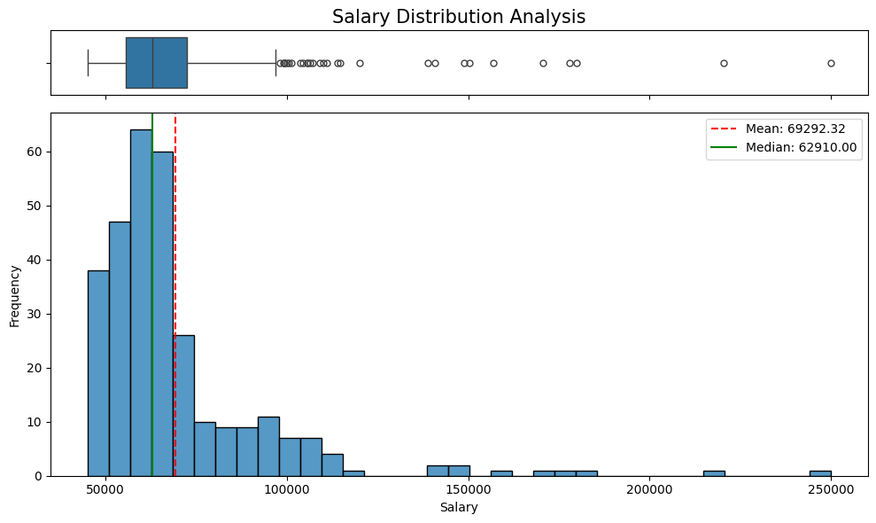
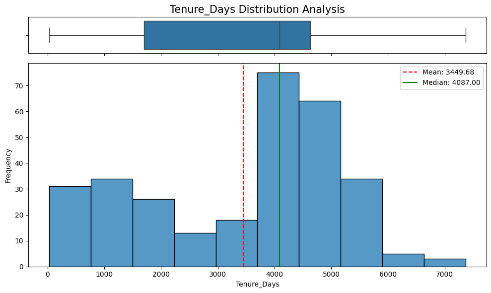

```python
import pandas as pd
import numpy as np
import matplotlib.pyplot as plt
import seaborn as sns
```


```python
df = pd.read_csv('../Data/HRDataset_v14.csv')
df.head()
```


<div>
<style scoped>
    .dataframe tbody tr th:only-of-type {
        vertical-align: middle;
    }

    .dataframe tbody tr th {
        vertical-align: top;
    }

    .dataframe thead th {
        text-align: right;
    }
</style>
<table border="1" class="dataframe">
  <thead>
    <tr style="text-align: right;">
      <th></th>
      <th>Employee_Name</th>
      <th>EmpID</th>
      <th>MarriedID</th>
      <th>MaritalStatusID</th>
      <th>GenderID</th>
      <th>EmpStatusID</th>
      <th>DeptID</th>
      <th>PerfScoreID</th>
      <th>FromDiversityJobFairID</th>
      <th>Salary</th>
      <th>...</th>
      <th>ManagerName</th>
      <th>ManagerID</th>
      <th>RecruitmentSource</th>
      <th>PerformanceScore</th>
      <th>EngagementSurvey</th>
      <th>EmpSatisfaction</th>
      <th>SpecialProjectsCount</th>
      <th>LastPerformanceReview_Date</th>
      <th>DaysLateLast30</th>
      <th>Absences</th>
    </tr>
  </thead>
  <tbody>
    <tr>
      <th>0</th>
      <td>Adinolfi, Wilson&nbsp;&nbsp;K</td>
      <td>10026</td>
      <td>0</td>
      <td>0</td>
      <td>1</td>
      <td>1</td>
      <td>5</td>
      <td>4</td>
      <td>0</td>
      <td>62506</td>
      <td>...</td>
      <td>Michael Albert</td>
      <td>22.0</td>
      <td>LinkedIn</td>
      <td>Exceeds</td>
      <td>4.60</td>
      <td>5</td>
      <td>0</td>
      <td>1/17/2019</td>
      <td>0</td>
      <td>1</td>
    </tr>
    <tr>
      <th>1</th>
      <td>Ait Sidi, Karthikeyan</td>
      <td>10084</td>
      <td>1</td>
      <td>1</td>
      <td>1</td>
      <td>5</td>
      <td>3</td>
      <td>3</td>
      <td>0</td>
      <td>104437</td>
      <td>...</td>
      <td>Simon Roup</td>
      <td>4.0</td>
      <td>Indeed</td>
      <td>Fully Meets</td>
      <td>4.96</td>
      <td>3</td>
      <td>6</td>
      <td>2/24/2016</td>
      <td>0</td>
      <td>17</td>
    </tr>
    <tr>
      <th>2</th>
      <td>Akinkuolie, Sarah</td>
      <td>10196</td>
      <td>1</td>
      <td>1</td>
      <td>0</td>
      <td>5</td>
      <td>5</td>
      <td>3</td>
      <td>0</td>
      <td>64955</td>
      <td>...</td>
      <td>Kissy Sullivan</td>
      <td>20.0</td>
      <td>LinkedIn</td>
      <td>Fully Meets</td>
      <td>3.02</td>
      <td>3</td>
      <td>0</td>
      <td>5/15/2012</td>
      <td>0</td>
      <td>3</td>
    </tr>
    <tr>
      <th>3</th>
      <td>Alagbe,Trina</td>
      <td>10088</td>
      <td>1</td>
      <td>1</td>
      <td>0</td>
      <td>1</td>
      <td>5</td>
      <td>3</td>
      <td>0</td>
      <td>64991</td>
      <td>...</td>
      <td>Elijiah Gray</td>
      <td>16.0</td>
      <td>Indeed</td>
      <td>Fully Meets</td>
      <td>4.84</td>
      <td>5</td>
      <td>0</td>
      <td>1/3/2019</td>
      <td>0</td>
      <td>15</td>
    </tr>
    <tr>
      <th>4</th>
      <td>Anderson, Carol</td>
      <td>10069</td>
      <td>0</td>
      <td>2</td>
      <td>0</td>
      <td>5</td>
      <td>5</td>
      <td>3</td>
      <td>0</td>
      <td>50825</td>
      <td>...</td>
      <td>Webster Butler</td>
      <td>39.0</td>
      <td>Google Search</td>
      <td>Fully Meets</td>
      <td>5.00</td>
      <td>4</td>
      <td>0</td>
      <td>2/1/2016</td>
      <td>0</td>
      <td>2</td>
    </tr>
  </tbody>
</table>
<p>5 rows × 36 columns</p>
</div>


```python
df.columns
```


    Index(['Employee_Name', 'EmpID', 'MarriedID', 'MaritalStatusID', 'GenderID',
           'EmpStatusID', 'DeptID', 'PerfScoreID', 'FromDiversityJobFairID',
           'Salary', 'Termd', 'PositionID', 'Position', 'State', 'Zip', 'DOB',
           'Sex', 'MaritalDesc', 'CitizenDesc', 'HispanicLatino', 'RaceDesc',
           'DateofHire', 'DateofTermination', 'TermReason', 'EmploymentStatus',
           'Department', 'ManagerName', 'ManagerID', 'RecruitmentSource',
           'PerformanceScore', 'EngagementSurvey', 'EmpSatisfaction',
           'SpecialProjectsCount', 'LastPerformanceReview_Date', 'DaysLateLast30',
           'Absences'],
          dtype='str')


```python
df.describe()
```


<div>
<style scoped>
    .dataframe tbody tr th:only-of-type {
        vertical-align: middle;
    }

    .dataframe tbody tr th {
        vertical-align: top;
    }

    .dataframe thead th {
        text-align: right;
    }
</style>
<table border="1" class="dataframe">
  <thead>
    <tr style="text-align: right;">
      <th></th>
      <th>EmpID</th>
      <th>MarriedID</th>
      <th>MaritalStatusID</th>
      <th>GenderID</th>
      <th>EmpStatusID</th>
      <th>DeptID</th>
      <th>PerfScoreID</th>
      <th>FromDiversityJobFairID</th>
      <th>Salary</th>
      <th>Termd</th>
      <th>PositionID</th>
      <th>Zip</th>
      <th>ManagerID</th>
      <th>EngagementSurvey</th>
      <th>EmpSatisfaction</th>
      <th>SpecialProjectsCount</th>
      <th>DaysLateLast30</th>
      <th>Absences</th>
    </tr>
  </thead>
  <tbody>
    <tr>
      <th>count</th>
      <td>311.000000</td>
      <td>311.000000</td>
      <td>311.000000</td>
      <td>311.000000</td>
      <td>311.000000</td>
      <td>311.000000</td>
      <td>311.000000</td>
      <td>311.000000</td>
      <td>311.000000</td>
      <td>311.000000</td>
      <td>311.000000</td>
      <td>311.000000</td>
      <td>303.000000</td>
      <td>311.000000</td>
      <td>311.000000</td>
      <td>311.000000</td>
      <td>311.000000</td>
      <td>311.000000</td>
    </tr>
    <tr>
      <th>mean</th>
      <td>10156.000000</td>
      <td>0.398714</td>
      <td>0.810289</td>
      <td>0.434084</td>
      <td>2.392283</td>
      <td>4.610932</td>
      <td>2.977492</td>
      <td>0.093248</td>
      <td>69020.684887</td>
      <td>0.334405</td>
      <td>16.845659</td>
      <td>6555.482315</td>
      <td>14.570957</td>
      <td>4.110000</td>
      <td>3.890675</td>
      <td>1.218650</td>
      <td>0.414791</td>
      <td>10.237942</td>
    </tr>
    <tr>
      <th>std</th>
      <td>89.922189</td>
      <td>0.490423</td>
      <td>0.943239</td>
      <td>0.496435</td>
      <td>1.794383</td>
      <td>1.083487</td>
      <td>0.587072</td>
      <td>0.291248</td>
      <td>25156.636930</td>
      <td>0.472542</td>
      <td>6.223419</td>
      <td>16908.396884</td>
      <td>8.078306</td>
      <td>0.789938</td>
      <td>0.909241</td>
      <td>2.349421</td>
      <td>1.294519</td>
      <td>5.852596</td>
    </tr>
    <tr>
      <th>min</th>
      <td>10001.000000</td>
      <td>0.000000</td>
      <td>0.000000</td>
      <td>0.000000</td>
      <td>1.000000</td>
      <td>1.000000</td>
      <td>1.000000</td>
      <td>0.000000</td>
      <td>45046.000000</td>
      <td>0.000000</td>
      <td>1.000000</td>
      <td>1013.000000</td>
      <td>1.000000</td>
      <td>1.120000</td>
      <td>1.000000</td>
      <td>0.000000</td>
      <td>0.000000</td>
      <td>1.000000</td>
    </tr>
    <tr>
      <th>25%</th>
      <td>10078.500000</td>
      <td>0.000000</td>
      <td>0.000000</td>
      <td>0.000000</td>
      <td>1.000000</td>
      <td>5.000000</td>
      <td>3.000000</td>
      <td>0.000000</td>
      <td>55501.500000</td>
      <td>0.000000</td>
      <td>18.000000</td>
      <td>1901.500000</td>
      <td>10.000000</td>
      <td>3.690000</td>
      <td>3.000000</td>
      <td>0.000000</td>
      <td>0.000000</td>
      <td>5.000000</td>
    </tr>
    <tr>
      <th>50%</th>
      <td>10156.000000</td>
      <td>0.000000</td>
      <td>1.000000</td>
      <td>0.000000</td>
      <td>1.000000</td>
      <td>5.000000</td>
      <td>3.000000</td>
      <td>0.000000</td>
      <td>62810.000000</td>
      <td>0.000000</td>
      <td>19.000000</td>
      <td>2132.000000</td>
      <td>15.000000</td>
      <td>4.280000</td>
      <td>4.000000</td>
      <td>0.000000</td>
      <td>0.000000</td>
      <td>10.000000</td>
    </tr>
    <tr>
      <th>75%</th>
      <td>10233.500000</td>
      <td>1.000000</td>
      <td>1.000000</td>
      <td>1.000000</td>
      <td>5.000000</td>
      <td>5.000000</td>
      <td>3.000000</td>
      <td>0.000000</td>
      <td>72036.000000</td>
      <td>1.000000</td>
      <td>20.000000</td>
      <td>2355.000000</td>
      <td>19.000000</td>
      <td>4.700000</td>
      <td>5.000000</td>
      <td>0.000000</td>
      <td>0.000000</td>
      <td>15.000000</td>
    </tr>
    <tr>
      <th>max</th>
      <td>10311.000000</td>
      <td>1.000000</td>
      <td>4.000000</td>
      <td>1.000000</td>
      <td>5.000000</td>
      <td>6.000000</td>
      <td>4.000000</td>
      <td>1.000000</td>
      <td>250000.000000</td>
      <td>1.000000</td>
      <td>30.000000</td>
      <td>98052.000000</td>
      <td>39.000000</td>
      <td>5.000000</td>
      <td>5.000000</td>
      <td>8.000000</td>
      <td>6.000000</td>
      <td>20.000000</td>
    </tr>
  </tbody>
</table>
</div>


```python
df['DateofTermination'] = pd.to_datetime(df['DateofTermination'], errors='coerce')
df['DateofHire'] = pd.to_datetime(df['DateofHire'], errors='coerce')
df['Tenure_Days'] = (df['DateofTermination'].fillna(pd.Timestamp.now()) - df['DateofHire']).dt.days
df['DateofTermination'] = pd.to_datetime(df['DateofTermination'], format='%m/%d/%y', errors='coerce')
df['DateofHire'] = pd.to_datetime(df['DateofHire'], format='%m/%d/%y', errors='coerce')
```


```python
df['Position'].unique()
```


    <StringArray>
    [     'Production Technician I',                      'Sr. DBA',
         'Production Technician II',            'Software Engineer',
                       'IT Support',                 'Data Analyst',
           'Database Administrator',         'Enterprise Architect',
                   'Sr. Accountant',           'Production Manager',
                     'Accountant I',           'Area Sales Manager',
     'Software Engineering Manager',                  'BI Director',
           'Director of Operations',         'Sr. Network Engineer',
                    'Sales Manager',                 'BI Developer',
             'IT Manager - Support',             'Network Engineer',
                      'IT Director',            'Director of Sales',
         'Administrative Assistant',              'President & CEO',
              'Senior BI Developer',      'Shared Services Manager',
               'IT Manager - Infra',     'Principal Data Architect',
                   'Data Architect',              'IT Manager - DB',
                    'Data Analyst ',                          'CIO']
    Length: 32, dtype: str


Typo in 'Data Analyst '


```python
df['Position'] = df['Position'].str.strip()
```

# NaNs


```python
df.isna().sum()[df.isna().sum() > 0]
```


    DateofTermination    207
    ManagerID              8
    dtype: int64


```python
df.isna().sum()
```


    Employee_Name                   0
    EmpID                           0
    MarriedID                       0
    MaritalStatusID                 0
    GenderID                        0
    EmpStatusID                     0
    DeptID                          0
    PerfScoreID                     0
    FromDiversityJobFairID          0
    Salary                          0
    Termd                           0
    PositionID                      0
    Position                        0
    State                           0
    Zip                             0
    DOB                             0
    Sex                             0
    MaritalDesc                     0
    CitizenDesc                     0
    HispanicLatino                  0
    RaceDesc                        0
    DateofHire                      0
    DateofTermination             207
    TermReason                      0
    EmploymentStatus                0
    Department                      0
    ManagerName                     0
    ManagerID                       8
    RecruitmentSource               0
    PerformanceScore                0
    EngagementSurvey                0
    EmpSatisfaction                 0
    SpecialProjectsCount            0
    LastPerformanceReview_Date      0
    DaysLateLast30                  0
    Absences                        0
    Tenure_Days                     0
    dtype: int64


So many NaN values in 'DateofTermination' likely means that those employer are still active


```python
df['DateofTermination'] = df['DateofTermination'].fillna('Active')
```


```python
df['Position'].unique()
```


    <StringArray>
    [     'Production Technician I',                      'Sr. DBA',
         'Production Technician II',            'Software Engineer',
                       'IT Support',                 'Data Analyst',
           'Database Administrator',         'Enterprise Architect',
                   'Sr. Accountant',           'Production Manager',
                     'Accountant I',           'Area Sales Manager',
     'Software Engineering Manager',                  'BI Director',
           'Director of Operations',         'Sr. Network Engineer',
                    'Sales Manager',                 'BI Developer',
             'IT Manager - Support',             'Network Engineer',
                      'IT Director',            'Director of Sales',
         'Administrative Assistant',              'President & CEO',
              'Senior BI Developer',      'Shared Services Manager',
               'IT Manager - Infra',     'Principal Data Architect',
                   'Data Architect',              'IT Manager - DB',
                              'CIO']
    Length: 31, dtype: str


```python
df[df['ManagerID'].isna()].groupby('Position').size()
```


    Position
    Production Technician I     4
    Production Technician II    4
    dtype: int64


```python
managersI = df[df['Position'] == 'Production Technician I']['ManagerID'].unique()
print(managersI)
```

    [22. 16. 39. 11. 19. 12. 14. 20. 18. nan]
    


```python
managersII = df[df['Position'] == 'Production Technician II']['ManagerID'].unique()
print(managersII)
```

    [20. 18. 22. 16. nan 11. 19. 12. 14. 30. 39.]
    

Impossible to impute the correct 'ManagerID'. Those 8 rows will be dropped


```python
df = df.dropna(subset=['ManagerID'])
```


```python
df.isna().sum()[df.isna().sum() > 0]
```


    Series([], dtype: int64)


All good!

# Outliers


```python
cols_to_plot = ['Salary', 'Absences', 'EngagementSurvey', 'EmpSatisfaction', 'Tenure_Days']

for col in cols_to_plot:
    f, (ax_box, ax_hist) = plt.subplots(2, sharex=True, 
                                        gridspec_kw={"height_ratios": (.15, .85)}, 
                                        figsize=(10, 6))

    sns.boxplot(x=df[col], ax=ax_box, fliersize=5)
    ax_box.set(xlabel='')
    ax_box.set_title(f'{col} Distribution Analysis', fontsize=15)

    sns.histplot(df[col], ax=ax_hist)
    ax_hist.set(xlabel=col, ylabel='Frequency')

    plt.axvline(df[col].mean(), color='red', linestyle='--', label=f"Mean: {df[col].mean():.2f}")
    plt.axvline(df[col].median(), color='green', linestyle='-', label=f"Median: {df[col].median():.2f}")
    plt.legend()

    plt.tight_layout()
    plt.show()
```


    

    


    

    


    

    


    

    


    

    


Salaries and engagement have outliers, but they should not be removed
