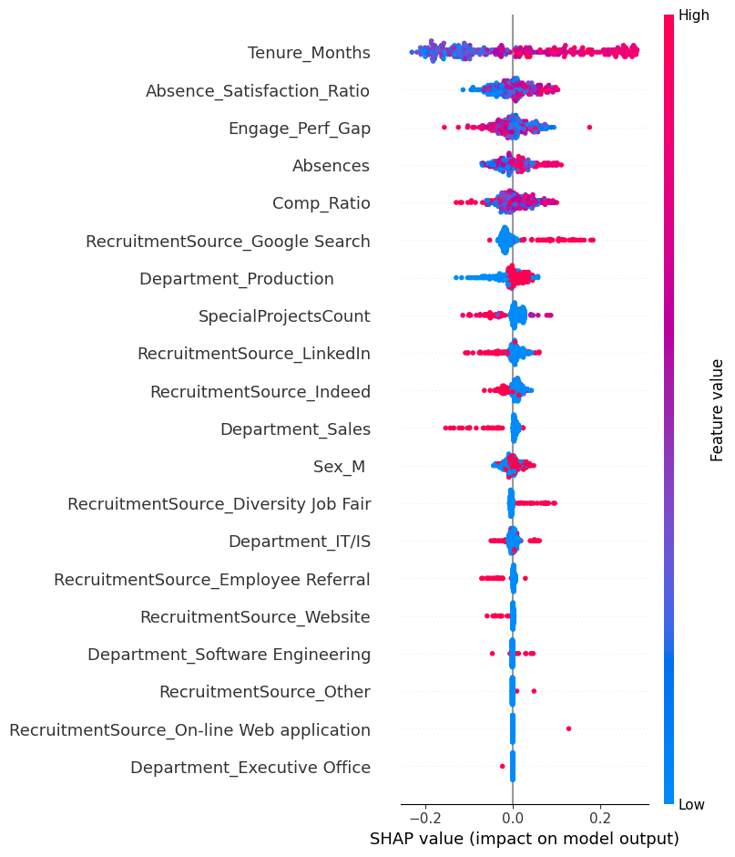
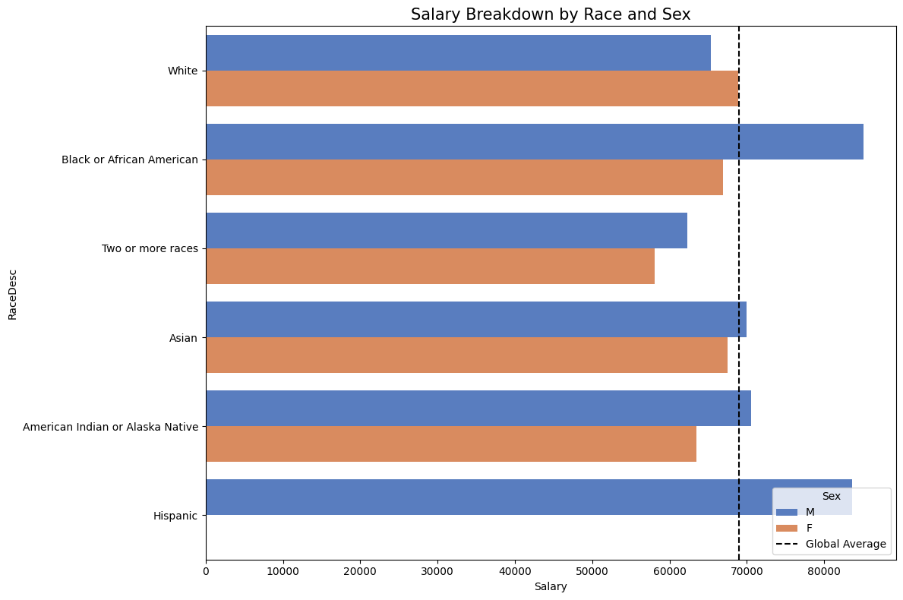
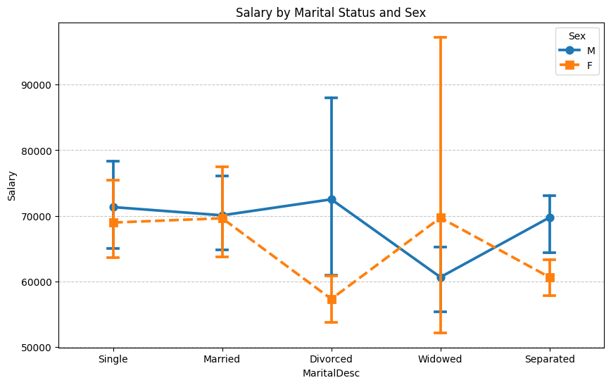
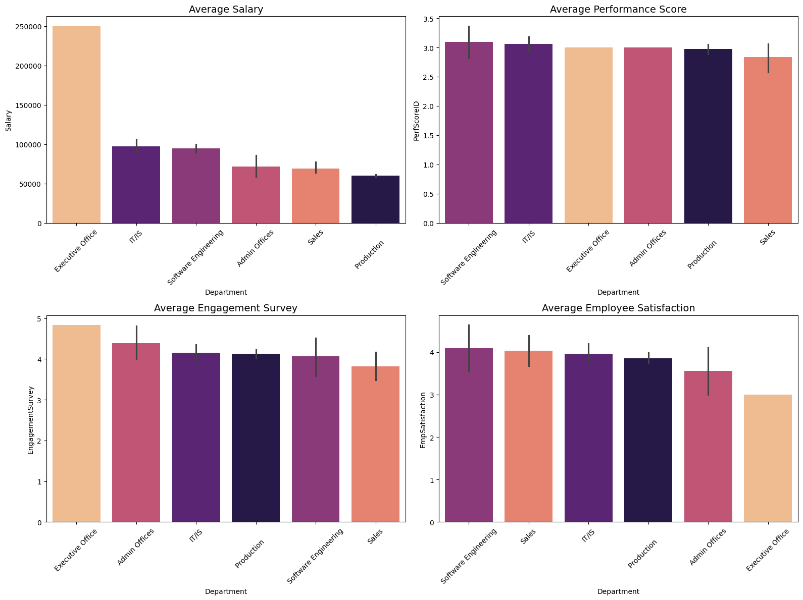

# HR Data Science Project

This project applies a full data science pipeline to the **HRDataset_v14.csv** dataset. The goal is to move past descriptive statistics and uncover what actually drives employee behaviour, compensation inequities, and turnover risk. The analysis is structured in three parts: an exploratory phase that examines correlations and pay distribution, a discrimination analysis that tests whether race and sex are independently associated with salary, and a talent risk framework built on two machine learning models (one predicting attrition, one identifying high performers) whose outputs are combined to flag the employees most likely to leave.

---

## At a Glance

### Attrition Model

A weighted Random Forest Classifier trained to predict termination, evaluated on ROC-AUC and F1 rather than accuracy because the classes are imbalanced and a naive model that always predicts "active" would score ~66% accuracy while being entirely useless.

| Metric | Mean | Std |
|---|---|---|
| ROC-AUC | 0.780 | ±0.049 |
| F1-Score | 0.625 | ±0.071 |
| Brier Score | 0.173 | ±0.019 |



Tenure is the dominant signal: employees who have been with the company for longer carry the highest attrition risk, a counterintuitive finding that likely reflects accumulated dissatisfaction or stagnation over time. The absence-satisfaction ratio comes next: employees who accumulate absences relative to their job satisfaction score are significantly more likely to leave. The engagement-performance gap and raw absence count add further signal, and relative pay also contributes, confirming that disengagement and dissatisfaction compound flight risk beyond compensation alone.

---

### Performance Driver Model

A Random Forest Classifier predicting whether an employee is a High Performer (defined as *Fully Meets* or *Exceeds* expectations). Random Forest was chosen over Logistic Regression here because the relationship between engagement, satisfaction, and performance is non-linear and the ensemble structure handles it without manual feature interaction terms.

| Metric | Mean | Std |
|---|---|---|
| ROC-AUC | 0.894 | ±0.093 |
| F1-Score | 0.978 | ±0.012 |
| Brier Score | 0.036 | ±0.015 |


`EngagementSurvey` is by a wide margin the strongest predictor of high performance, followed by `EmpSatisfaction`. Both features show that high values push the model strongly toward the High Performer class. `DeptID` contributes, but its SHAP spread is narrower. The message is direct: performance is an engagement problem before it is a skills or compensation problem.

---

### Discrimination Analysis Overview

Race and sex pay gaps are visible in the raw data. After applying Shapiro-Wilk normality checks, Mann-Whitney U tests, Kruskal-Wallis tests, and OLS regression controlling for position and department, the gaps largely dissolve. The one notable exception is Black male employees, whose higher average salary ($85,066 vs $66,963 for Black female employees) is explained entirely by role concentration at higher-paying positions, not by preferential pay within any given role.

---

## Exploratory Data Analysis

### Why Spearman and Not Pearson

The dataset contains several ordinal variables (employee satisfaction is scored 1-5, performance is categorised into four tiers) and the salary distribution is right-skewed with high-earner outliers at the executive level. Pearson correlation assumes linearity and is sensitive to those outliers. Spearman evaluates whether the *rank ordering* of one variable tracks the rank ordering of another, which is the right question to ask when at least one variable is ordinal or the relationship is monotonic but not strictly linear. Using Pearson here would have produced misleading coefficients for any pair involving satisfaction or performance scores.


The heatmap shows a few things worth noting. Engagement survey scores and performance scores have a moderate positive correlation (rho = 0.38), which is the strongest signal in the matrix and is confirmed later at the department level. Days late in the last 30 days correlates more strongly with performance (rho = -0.68) than with engagement (rho = -0.43), but the fact that both correlations are substantial suggests lateness is a symptom of broader disengagement rather than an independent cause of poor output. Salary and number of special projects share the strongest correlation in the matrix (rho = 0.51), which reflects that higher-paid, senior employees are more likely to be assigned to special projects. Most other correlations are weak, which means the features are largely independent, a useful property for modelling.

---

### Attrition Rates

The global attrition rate across the organisation is **33.4%**, which is high enough to treat as a structural problem rather than a statistical artefact. Broken down by department:

| Department | Attrition Rate |
|---|---|
| Production | 39.7% |
| Software Engineering | 36.4% |
| Admin Offices | 22.2% |
| IT/IS | 20.0% |
| Sales | 16.1% |
| Executive Office | 0.0% |

Production drives the headline number both in rate and in raw volume; it is the largest department by headcount. The Executive Office has zero attrition, which reflects its small size (n=1) and should not be read as a management signal.

---

### Departmental Correlations: Salary, Performance, Engagement, and Satisfaction

To test whether the global correlations hold uniformly across the business, Spearman correlations between salary, performance, engagement, and satisfaction were computed per department and p-values corrected using the Holm-Bonferroni method to control the family-wise error rate across multiple comparisons.

**Engagement → Performance (corrected p-values)**

| Department | ρ | p (corrected) | Significant |
|---|---|---|---|
| Software Engineering | 0.640 | 0.044 | Yes |
| Sales | 0.536 | 0.006 | Yes |
| Production | 0.361 | <0.001 | Yes |
| IT/IS | 0.323 | 0.044 | Yes |
| Admin Offices | n/a | n/a | n/a |
| Executive Office | n/a | n/a | n/a |

Engagement predicts performance significantly in all four departments with sufficient sample sizes. The effect is strongest in Software Engineering (ρ = 0.640, n=11) and weakest in Production (ρ = 0.361, n=209), though the Production result is the most statistically stable given the sample.

**Satisfaction → Performance (corrected p-values)**

| Department | ρ | p (corrected) | Significant |
|---|---|---|---|
| IT/IS | 0.371 | 0.032 | Yes |
| Production | 0.167 | 0.047 | Yes |
| Sales | 0.368 | 0.083 | No |
| Software Engineering | 0.207 | 0.542 | No |

Satisfaction is a significant performance predictor in IT/IS and Production but not in Sales or Software Engineering. This is not noise; it reflects a real difference in what motivates output across functions. In IT/IS, where work is often collaborative and ongoing, satisfaction with the environment matters. In Software Engineering, engagement (project alignment, intellectual stimulation) appears to be what moves performance, not satisfaction per se. This distinction has direct management implications.

**Salary → Engagement and Salary → Performance** showed no significant correlations in any department after correction, which means pay is not the lever for either engagement or performance in this dataset.

---

### Compensation by Position


The company average sits at **$69,021**. Senior technical and executive roles dominate the upper end (President & CEO, CIO, Director of Sales, IT Director), while Production Technician I and Administrative Assistant roles sit well below the mean. The distribution is heavily position-driven, which is relevant context for the discrimination analysis: any raw demographic pay gap is, to a large degree, a proxy for role distribution.

---

### Discrimination Analysis

The first step was to look at raw average salaries by race and sex.





Hispanic employees show the highest average salary in the race breakdown, and Black or African American employees come second. Women show a marginally higher average salary than men across the full company. Neither of these raw figures should be interpreted as evidence of anything without controlling for role.


The breakdown by race and sex reveals a pattern that the aggregated bars conceal. Black male employees have a mean salary of $85,066 compared to $66,963 for Black female employees, a $18,102 gap. White female employees average $68,847 vs $65,334 for White male employees. The full summary:

| Race | Sex | N | Mean Salary | Median |
|---|---|---|---|---|
| Black or African American | M | 33 | $85,066 | $71,339 |
| Hispanic | M | 1 | $83,667 | $83,667 |
| White | F | 104 | $68,847 | $62,405 |
| American Indian/Alaska Native | M | 1 | $70,545 | $70,545 |
| Asian | M | 12 | $69,939 | $64,731 |
| Asian | F | 17 | $67,520 | $63,676 |
| White | M | 83 | $65,334 | $61,809 |
| Black or African American | F | 47 | $66,964 | $61,584 |
| American Indian/Alaska Native | F | 2 | $63,437 | $63,437 |
| Two or more races | M | 5 | $62,314 | $61,568 |
| Two or more races | F | 6 | $58,069 | $57,838 |

---

### Statistical Testing for Discrimination

Before any test was run, normality was checked with Shapiro-Wilk. Salary distributions for most demographic subgroups failed normality, so the analysis used Mann-Whitney U (for pairwise comparisons) and Kruskal-Wallis (for multi-group comparisons) throughout. Effect sizes were reported as the Common Language Effect Size (CLES) for Mann-Whitney results, which gives the probability that a randomly drawn individual from group A earns more than a randomly drawn individual from group B.

**Pairwise results (corrected with Holm-Bonferroni):**

| Comparison | Method | Raw p | CLES | Corrected p | Significant |
|---|---|---|---|---|---|
| White vs Black | Mann-Whitney U | 0.079 | 0.568 | 0.158 | No |
| M vs F (White) | Mann-Whitney U | 0.588 | 0.523 | 0.588 | No |
| M vs F (Black) | Mann-Whitney U | 0.022 | 0.349 | 0.067 | No |

None of the raw demographic comparisons survive correction. The CLES for M vs F (Black) is 0.349, which actually indicates that a randomly selected Black female employee has a *higher* probability of earning more than a randomly selected Black male; the direction of the mean gap is driven by a small number of high-earning Black males in senior roles.

**OLS regression: sex effect controlling for department and position:**

When salary is modelled as a function of sex while controlling for both department and position, the coefficient for being male is **-$159 (p = 0.834)**. Within the Black employee subsample only, controlling for position, the coefficient is **-$84 (p = 0.959)**. Both coefficients are economically negligible and statistically indistinguishable from zero.

To verify this directly: among Black employees in the Production Technician I role (the largest same-role subgroup), Black female employees earn a mean of **$56,518** vs $52,820 for Black male employees. The apparent advantage for Black males in the aggregate is entirely a composition effect; they are overrepresented in higher-paying positions like Director and Manager roles.

**Marital status and sex:**



An OLS regression with a full `MaritalDesc × Sex` interaction was run to test whether marital status interacts with sex to produce salary differences. Results:

| Term | F | p |
|---|---|---|
| MaritalDesc | 0.540 | 0.707 |
| Sex | 0.901 | 0.343 |
| MaritalDesc × Sex | 0.659 | 0.621 |

No term is significant. Marital status does not predict salary and does not interact with sex.

---

### Managers and Departments

Average salary, performance, engagement, and satisfaction were compared across managers and departments.


Formal significance tests (Chi-squared for discrete metrics, Kruskal-Wallis for engagement) found no statistically significant differences in performance or satisfaction across departments or managers after accounting for expected cell frequency constraints. The Kruskal-Wallis H for engagement across departments was 5.16 (p = 0.397), and across managers was 21.34 (p = 0.500). Visually, the Executive Office stands out on salary due to a single high-earning individual, not a systematic pattern.

Manager-level attrition deltas relative to their department baseline reveal more signal. Among managers with teams of five or more:

**Managers who reduce attrition below their department average:**

| Manager | Department | Team Attrition | Dept Average | Delta |
|---|---|---|---|---|
| Brian Champaigne | IT/IS | 0.0% | 20.0% | -20.0pp |
| Peter Monroe | IT/IS | 7.1% | 20.0% | -12.9pp |
| Ketsia Liebig | Production | 23.8% | 39.7% | -15.9pp |

**Managers with attrition above their department average:**

| Manager | Department | Team Attrition | Dept Average | Delta |
|---|---|---|---|---|
| Simon Roup | IT/IS | 47.1% | 20.0% | +27.1pp |
| Amy Dunn | Production | 61.9% | 39.7% | +22.2pp |
| Webster Butler | Production | 61.9% | 39.7% | +22.2pp |

These deltas are not adjusted for tenure composition or role mix within each team, so they should be treated as hypothesis-generating rather than causal estimates.

---

## Machine Learning Modelling

### Goal

Two separate classification problems. The first predicts whether an employee will be terminated (`Termd = 1`). The second predicts whether an employee is a high performer (`PerformanceScore` in `['Fully Meets', 'Exceeds']`). The outputs of both models are combined in the Talent Risk Framework.

### Feature Engineering

Raw HR features were insufficient to capture the dynamics of risk and performance, so four composite features were constructed before modelling:

- **Relative pay (Comp_Ratio)**: employee salary divided by the average salary for their position. A value below 1.0 means the employee is paid below their peers in the same role. This is a more informative signal than raw salary because it controls for the position effect.
- **Tenure in months**: exact employment duration computed from the hire date using datetime arithmetic, rather than using a categorical tenure bucket.
- **Engagement-performance gap**: normalised performance score minus normalised engagement score. A positive gap means the employee performs above what their engagement would predict; a negative gap is potentially a signal of disengagement preceding attrition.
- **Absence-satisfaction ratio**: number of absences divided by (job satisfaction score + 1). This captures the interaction between attendance behaviour and how the employee feels about the job. The +1 avoids division by zero.

### Validation Strategy

Both models use a **Repeated Stratified K-Fold** cross-validation scheme (5 splits, 10 repeats). Stratification ensures that the minority class (terminated employees for attrition, non-high-performers for performance) is proportionally represented in every fold. Repeating the 5-fold process 10 times gives 50 evaluation scores per metric, which substantially reduces the variance of the estimate compared to a single train/test split. This matters on a dataset of ~300 employees: a single holdout split could easily produce an optimistic or pessimistic result purely by chance.

**Why not accuracy?** With a ~33% termination rate, a model that always predicts "active" achieves 66.6% accuracy without learning anything. ROC-AUC measures the model's ability to rank positive cases above negative cases regardless of threshold, and F1 balances precision and recall on the positive class. These are the metrics that matter for a deployment where the goal is to identify who is at risk, not to minimise global error.

### Attrition Model: Logistic Regression vs Random Forest

Both models were trained on the same feature set and evaluated under identical cross-validation conditions.

| Model | ROC-AUC | F1-Score | Brier Score |
|---|---|---|---|
| Logistic Regression | 0.738 ± 0.055 | 0.632 ± 0.064 | 0.210 ± 0.026 |
| Random Forest | 0.780 ± 0.049 | 0.625 ± 0.071 | 0.173 ± 0.019 |

The Random Forest outperforms Logistic Regression on ROC-AUC (+0.042) and Brier Score (-0.037), with a narrower standard deviation on both, indicating more stable predictions across folds. The F1 scores are essentially tied (0.632 vs 0.625), but the better Brier score means the Random Forest's probability estimates are better calibrated, which matters for the risk scoring used in the Talent Risk Framework downstream. The attrition model saved to disk is the Random Forest.


The SHAP plot confirms what the feature engineering was designed to capture. Tenure has the widest spread: short tenure pushes attrition probability up sharply. The absence-satisfaction ratio and the engagement-performance gap both show that high values increase flight risk. Being paid below the position average is a positive predictor of leaving. Being recruited via Google Search and working in Production carry additional positive SHAP mass, consistent with the raw attrition rates seen in the EDA.

### Performance Driver Model

The performance model uses a narrower feature set: absences, engagement survey, employee satisfaction, and department ID. The target is binary (High Performer vs not), with "Fully Meets" and "Exceeds" grouped together because the dataset has very few employees in the "Exceeds" category alone, making a multi-class formulation unreliable.

| Metric | Mean | Std |
|---|---|---|
| ROC-AUC | 0.894 | ±0.093 |
| F1-Score | 0.978 | ±0.012 |
| Brier Score | 0.036 | ±0.015 |

The model performs exceptionally well. The F1 of 0.978 reflects that high performers are actually the majority class (most employees meet expectations), so the class balance works in the model's favour here. The ROC-AUC of 0.894 is the more informative figure; it shows the model genuinely discriminates between performance levels.


Engagement survey scores dominate. High engagement pushes SHAP contributions strongly positive (toward High Performer). Job satisfaction contributes similarly but with smaller magnitude. Absences have a moderate negative contribution: more absences pushes the model away from the High Performer class. Department adds marginal signal. The practical takeaway: engagement is not just correlated with performance, it is the primary input the model uses to make predictions.

---

## Talent Risk Framework

The two models are applied to the current active workforce. Each employee receives an `Attrition_Risk_%` from the attrition model and a `Performance_Success_%` from the performance model. The Stars-at-Risk are then defined as employees where:

```
Performance_Success_% > 70 AND Attrition_Risk_% > 60
```

**86 employees meet this threshold.**

The top of the risk list:

| Employee | Position | Attrition Risk | Performance Score |
|---|---|---|---|
| Anderson, Carol | Production Technician I | 100% | 100% |
| Fitzpatrick, Michael J | Production Technician II | 97% | 100% |
| Bondwell, Betsy | Production Technician II | 96% | 100% |
| Huynh, Ming | Production Technician II | 96% | 100% |
| Bates, Norman | Production Technician I | 95% | 98% |

The lower boundary of the list includes more diverse roles: a Sales Manager (Kampew, Donysha), a Software Engineer (True, Edward), a Database Administrator (Becker, Renee), and a Data Analyst (Pearson, Randall), all with attrition risk in the 63-70% range and performance scores at or above 95%.

The Production Technician concentration at the top of the list is consistent with that department's 39.7% attrition rate and reflects that many high-performing technicians have the short tenure and below-average comp ratios that the model associates with imminent departure. The more actionable cases for retention intervention are arguably the mid-list employees in specialised roles (Software Engineer, Database Administrator, Data Analyst) where replacement costs are higher and institutional knowledge loss is harder to recover.

---

## Key Findings

**Engagement is the central variable in this dataset.** It is the strongest predictor of performance in all four tested departments, it correlates negatively with lateness, and it drives the SHAP output of the performance model. Interventions that increase engagement (project ownership, career development visibility, manager quality) are likely to move both retention and performance simultaneously.

**Pay below position average predicts attrition more than pay in absolute terms.** Employees who are paid below what their role peers earn are more likely to leave, regardless of whether their absolute salary is high or low. Salary benchmarking at the role level is a more effective retention tool than across-the-board increases.

**No statistically significant race or sex discrimination in pay was found after controlling for position.** The raw gaps are real but are explained by role distribution. The OLS sex coefficient after controlling for department and position is -159 (p = 0.834), effectively zero. The one group that warrants monitoring is Black female employees in Production, not because the gap is statistically significant but because the sample sizes are large enough to detect a real difference if one emerges over time.

**Production is the single largest organisational risk.** It has the highest attrition rate (39.7%), the most Stars-at-Risk employees, and two managers running attrition rates 22 percentage points above the departmental average. The department-level engagement Kruskal-Wallis test was non-significant (H=5.16, p=0.397), suggesting the problem is not that Production employees are less engaged than average; it is structural, likely driven by role characteristics, compensation levels, and manager-specific dynamics.

**Short tenure is the strongest attrition signal by a wide margin.** The SHAP spread for tenure is larger than all other features combined. Early-career intervention (structured onboarding, 90-day check-ins, comp review at six months) is likely to have the highest return on retention investment.
