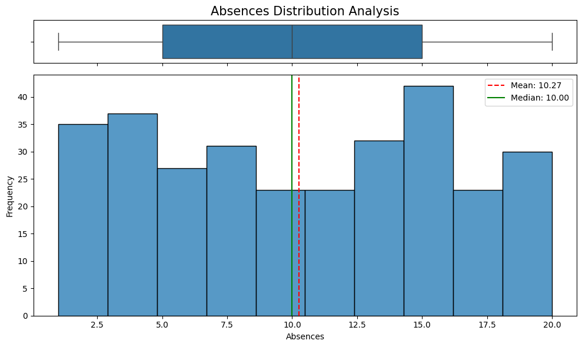
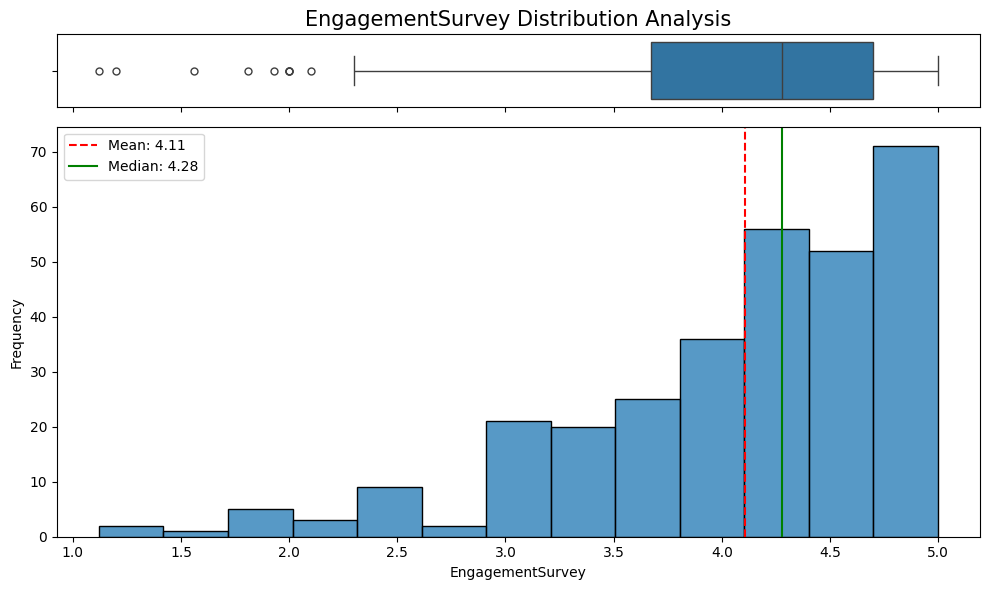
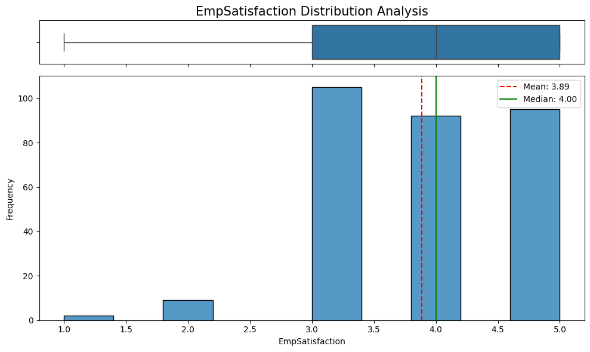
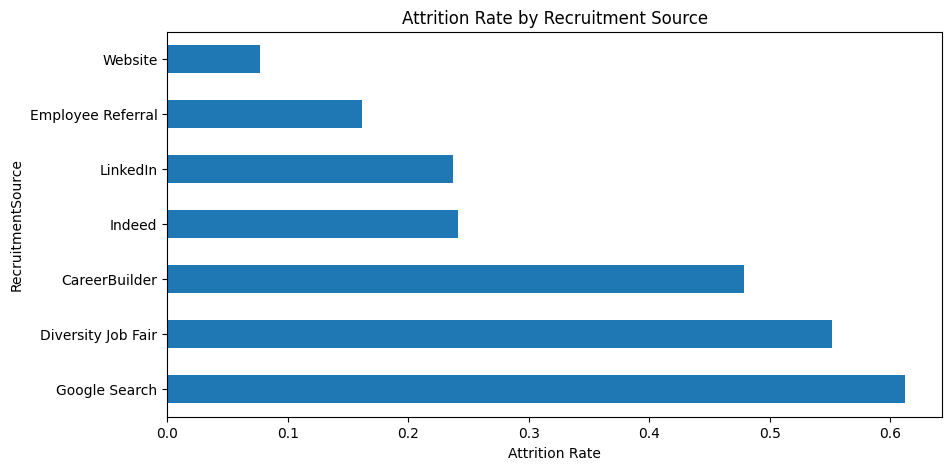
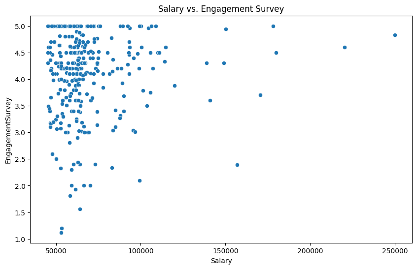
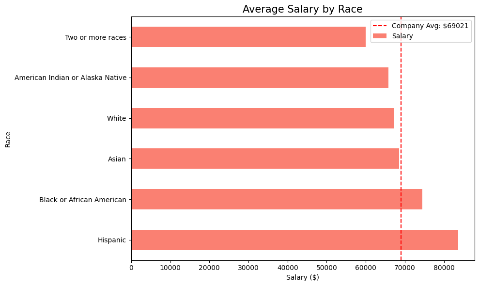
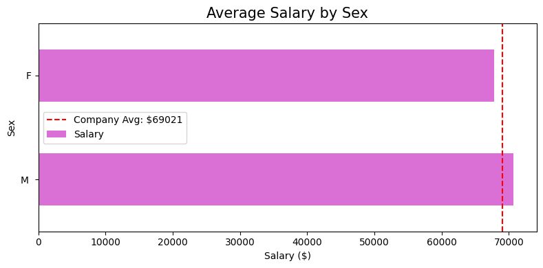

# HR-data-science-project

This repository contains notebooks for HR data analysis, covering data cleaning, exploratory data analysis (EDA), performance driver analysis, and attrition modeling.

## Visualizations from Notebooks

Here are some of the key visualizations generated across the different phases of the project:

### Data Cleaning

### Exploratory Data Analysis (EDA)

### Performance Driver Analysis

### Attrition Modeling

